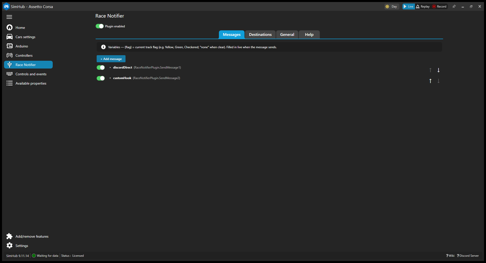
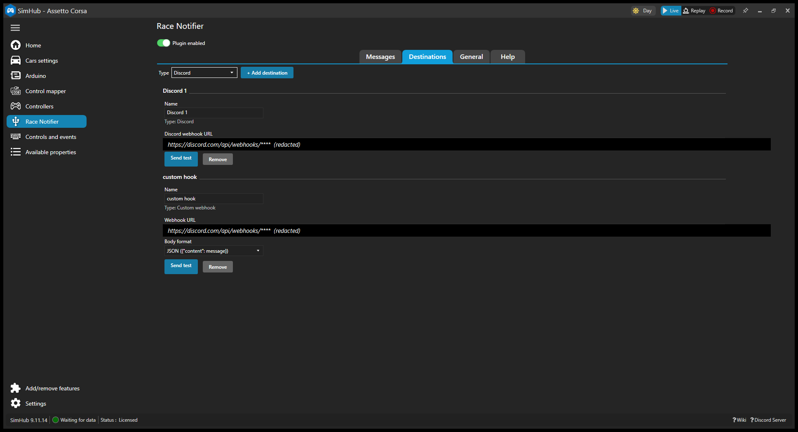
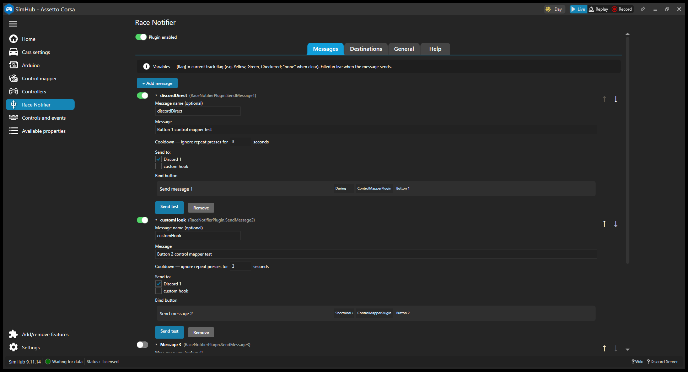
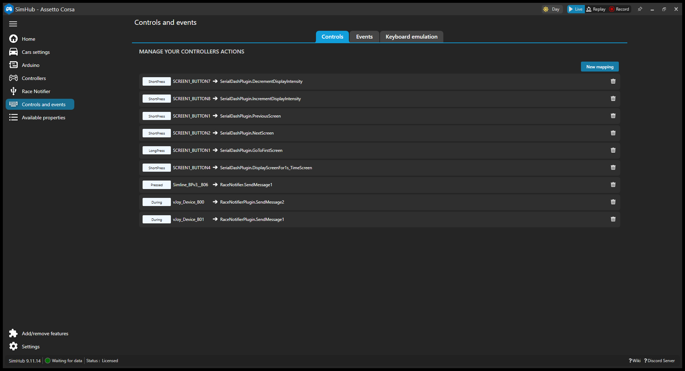
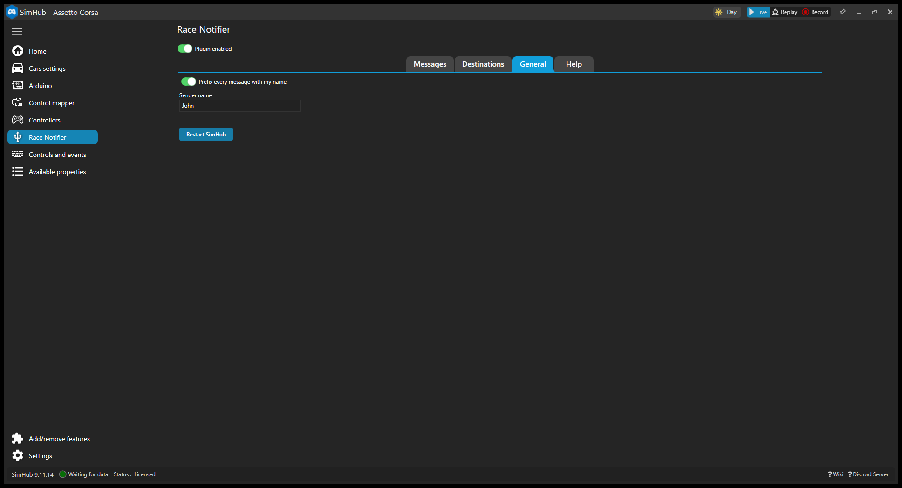

# Race Notifier for SimHub

Race Notifier lets you press a button on your wheel and send a preset message to your team's Discord channel or another webhook. Use it for quick team radio messages like "Pitting this lap", "Need a gap", or "GG" without taking your hands off the wheel.

<!-- Screenshot: Race Notifier panel open in SimHub's left menu -->


## Install (No Building)

You do not need Visual Studio or any developer tools for this.

1. Download `RaceNotifier-v0.2.0.zip` from the [latest release](../../releases/latest).
2. Open the zip file.
3. Copy `RaceNotifier.dll` into your SimHub folder:
   `C:\Program Files (x86)\SimHub\`
4. Restart SimHub.
5. When SimHub asks, enable **Race Notifier**.

<!-- Screenshot: SimHub plugins list or enable toggle for Race Notifier -->


## Quick Start

### 1. Add Your Discord Destination

A destination is where Race Notifier sends your message.

1. In Discord, open **Server Settings**.
2. Go to **Integrations**.
3. Open **Webhooks**.
4. Create a new webhook for the channel your team watches.
5. Copy the webhook URL.
6. In SimHub, open **Race Notifier** from the left menu.
7. Open the **Destinations** tab.
8. Add a **Discord** destination.
9. Paste the webhook URL.

<!-- Screenshot: Destinations tab with Discord webhook URL field -->


### 2. Add a Message

1. Open the **Messages** tab.
2. Click **Add message**.
3. Type the message you want to send.
4. Pick the destination you added.
5. Set a cooldown if you want one.

Cooldown means Race Notifier waits before the same message can send again. The default is 3 seconds. This helps avoid double-sends.

You can also include `{flag}` in a message. Race Notifier replaces it with the current track flag when the message sends. It uses `none` when the track is clear or the game is not running.

<!-- Screenshot: Message row expanded with text, destination, and cooldown -->


### 3. Bind It to a Wheel Button

Binding means telling SimHub which wheel button should send the message.

1. Find your message row.
2. Click its bind button.
3. Press the wheel button you want to use.

You can also bind messages from SimHub's **Controls & Events** screen.

<!-- Screenshot: In-row bind button and/or Controls & Events with SendMessageN and press-type dropdown -->


### 4. Press the Button

Press your bound wheel button. The message posts to your Discord channel.

> [!IMPORTANT]
> **Upgrading from an older version? Re-bind your buttons.**
>
> Version v0.2.0 changed how Race Notifier connects buttons to SimHub. Because of that, SimHub forgets old Race Notifier button assignments.
>
> You only need to fix this once. Click each message's bind button and press your wheel button again. You can also do the same thing in SimHub's **Controls & Events** screen.

## Press Types

Race Notifier supports SimHub's native press types:

- **Short press**
- **Long press**
- **Short and long press**

To use them:

1. Open SimHub's **Controls & Events** screen.
2. Find the control named `RaceNotifierPlugin.SendMessageN`.
3. Replace `N` with the message number you want to bind.
4. Pick the press type you want.
5. Press your wheel button when SimHub asks.

## Custom Webhook Destination

A custom webhook is for sending Race Notifier messages to another service that accepts a simple HTTP `POST`. This is a little more technical than Discord.

1. Open the **Destinations** tab.
2. Add a destination.
3. Set its type to **Custom webhook**.
4. Paste the endpoint URL.
5. Pick a body format:
   - **JSON (`{"content": message}`)** is the default. Use this for Discord-style endpoints and other services that expect a JSON `content` field.
   - **Plain text** sends only the message text as `text/plain`.
6. Pick this destination from any message row.

The sender prefix from the **General** tab also applies to custom webhook messages. If the webhook returns a non-2xx response, Race Notifier logs the status code. It never logs the webhook URL.

## Settings Reference

<!-- Screenshot: General tab with master on/off switch and sender prefix -->


- **Messages**: Add, remove, collapse, expand, reorder, and enable messages. Each message can target one or more destinations.
- **Message warnings**: Race Notifier warns you about missing text, missing destinations, or missing webhook details.
- **Per-message cooldown**: The default is 3 seconds.
- **Sender prefix**: Adds text before each message. For example, `[John] Pitting this lap`.
- **Master on/off switch**: Turns Race Notifier sending on or off without unloading the plugin. This affects button sends and test sends.
- **Automatic retry**: Race Notifier tries once more after a failed send.
- **Dashboard properties**: `RaceNotifierPlugin.LastSendStatus` and `RaceNotifierPlugin.LastSendMessage`.
- **Dashboard events**: `RaceNotifierPlugin.MessageSent` and `RaceNotifierPlugin.MessageFailed`. You can use these with SimHub sounds, LEDs, or dashboards.
- **SimHub look and feel**: Race Notifier uses SimHub's native interface style.

## Security

Webhook URLs are secrets. Anyone with the URL may be able to post messages to that webhook.

SimHub stores webhook URLs at runtime in:

```text
SimHub\PluginsData\Common
```

Do not commit webhook URLs to this repository.

## Build From Source

This section is for developers.

Requirements:

- SimHub on Windows.
- .NET Framework 4.8 runtime.
- Visual Studio Build Tools 2022 with the **.NET desktop build tools** workload. This includes MSBuild and the .NET Framework 4.8 targeting pack.

The project resolves SimHub assemblies through the `SIMHUB_INSTALL_PATH` environment variable.

Example:

```text
C:\Program Files (x86)\SimHub\
```

Keep the trailing backslash.

Build from the repo root:

```powershell
& "C:\Program Files (x86)\Microsoft Visual Studio\2022\BuildTools\MSBuild\Current\Bin\MSBuild.exe" `
  RaceNotifier.sln /p:Configuration=Release
```

The post-build step copies `RaceNotifier.dll` and `RaceNotifier.pdb` into your SimHub folder. Restart SimHub and enable the plugin when prompted.

## Roadmap

- Optional telemetry-enriched messages, such as lap, position, and fuel.
- Optional sound presets when a message sends.
